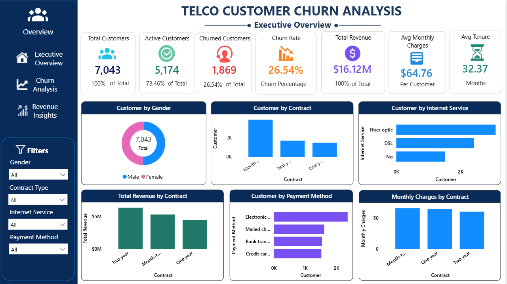
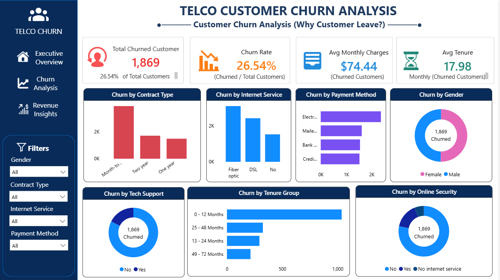
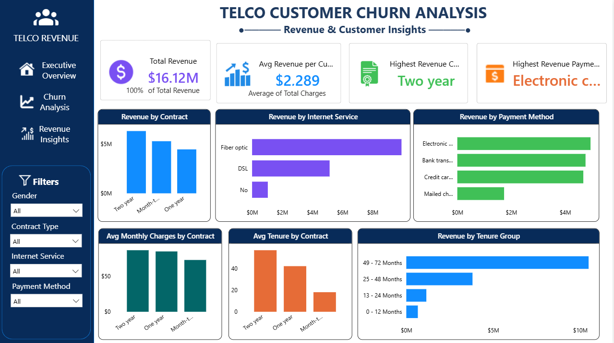

# Telco-Customer-Churn-Analysis

A complete **Data Analytics & Business Intelligence Project** that analyzes customer churn, revenue, and customer behavior using **Power BI, PostgreSQL, Python, Pandas, and Excel**. The project provides interactive dashboards and actionable insights to help businesses reduce customer churn and improve revenue.

---

##  Project Overview

Customer churn is one of the biggest challenges in the telecommunications industry. This project analyzes customer data to identify the key factors influencing churn and revenue.

The project follows the complete data analytics lifecycle—from data cleaning and SQL analysis to interactive dashboard creation and business storytelling.

---

## Objectives

- Analyze customer churn patterns.
- Identify factors affecting customer retention.
- Analyze revenue and customer value.
- Create interactive business dashboards.
- Provide data-driven business recommendations.

---

## Tools & Technologies

| Tool          |               Purpose                 |
|-------------- |---------------------------------------|
|  Power BI     | Dashboard Development & Visualization |
|  PostgreSQL   | Database & SQL Analysis               |
|  Python       | Data Cleaning                         |
|  Pandas       | Data Manipulation                     |
|  Excel        | Data Validation & Preprocessing       |

---

##  Dataset Information

- **Domain:** Telecommunications
- **Dataset:** Telco Customer Churn
- **Records:** 7,043 Customers
- **Columns:** 21
- **Format:** CSV

---

#  Project Workflow

CSV Dataset
      ↓
Excel Data Cleaning
      ↓
Python (Pandas)
      ↓
PostgreSQL Database
      ↓
SQL Analysis
      ↓
Power BI
      ↓
Interactive Dashboards
      ↓
Business Insights

---

#  Dashboards

## 1. Executive Overview

### KPIs

- Total Customers
- Active Customers
- Churned Customers
- Churn Rate
- Total Revenue
- Average Monthly Charges
- Average Tenure

### Visualizations

- Customers by Gender
- Customers by Contract
- Customers by Internet Service
- Revenue by Contract
- Customers by Payment Method
- Monthly Charges by Contract

---

## 2️. Customer Churn Analysis

### KPIs

- Total Churned Customers
- Churn Rate
- Average Monthly Charges (Churned)
- Average Tenure (Churned)

### Visualizations

- Churn by Contract Type
- Churn by Internet Service
- Churn by Payment Method
- Churn by Gender
- Churn by Tech Support
- Churn by Online Security
- Churn by Tenure Group

---

## 3️. Revenue & Customer Insights

### KPIs

- Total Revenue
- Average Revenue per Customer
- Highest Revenue Contract
- Highest Revenue Payment Method

### Visualizations

- Revenue by Contract
- Revenue by Internet Service
- Revenue by Payment Method
- Average Monthly Charges by Contract
- Average Tenure by Contract
- Revenue by Tenure Group

---

#  Key Insights

-  Customer Churn Rate: **26.54%**
-  Month-to-month contracts have the highest churn.
-  Fiber optic customers have the highest churn.
-  Electronic Check is the most common payment method.
-  Two-year contracts generate the highest revenue.
-  Customers with longer tenure contribute more revenue.
-  Customers with higher monthly charges are more likely to churn.

---

#  Business Recommendations

- Encourage long-term contracts through loyalty programs.
- Improve technical support services.
- Target high-risk customers with personalized offers.
- Reduce churn among new customers.
- Optimize pricing strategies for month-to-month customers.

---

#  Dashboard Preview

### Executive Overview

---

### Customer Churn Analysis

---

### Revenue & Customer Insights

---

#  Project Structure

Telco-Customer-Churn-Analysis/
│
├── Dataset/
│   └── Telco-Customer-Churn.csv
│
├── SQL/
│   ├── Database.sql
│   └── Analysis_Queries.sql
│
├── Python/
│   └── Data_Cleaning.ipynb
│
├── PowerBI/
│   └── Telco_Customer_Churn.pbix
│
├── Images/
│   ├── executive_overview.png
│   ├── churn_analysis.png
│   └── revenue_insights.png
│
├── Report/
│   └── Project_Report.pdf
│
└── README.md

---

#  Skills Demonstrated

- Data Cleaning
- Exploratory Data Analysis (EDA)
- SQL Query Writing
- PostgreSQL
- Power BI
- DAX
- KPI Design
- Dashboard Development
- Data Visualization
- Business Intelligence
- Business Storytelling

---

#  Future Improvements

- Customer Churn Prediction using Machine Learning
- Power BI Service Deployment
- Real-time Dashboard Refresh
- Customer Segmentation
- Forecasting & Trend Analysis

---

#  Author

**Prerana Halge**

 BCA Student | Aspiring Data Analyst

### Connect with Me

-  LinkedIn: www.linkedin.com/in/prerana-halge-411784349
-  GitHub: https://github.com/preranahalge-pixel

---

##  If you found this project helpful, please consider giving it a Star!
